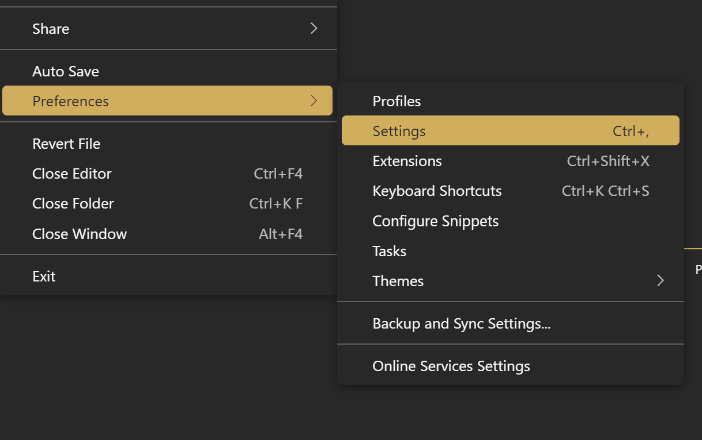
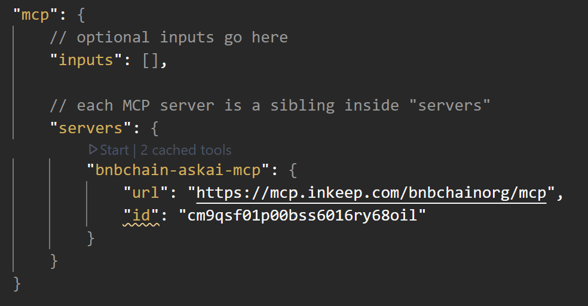
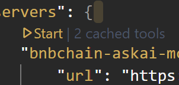
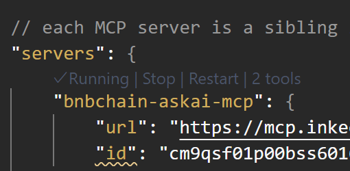
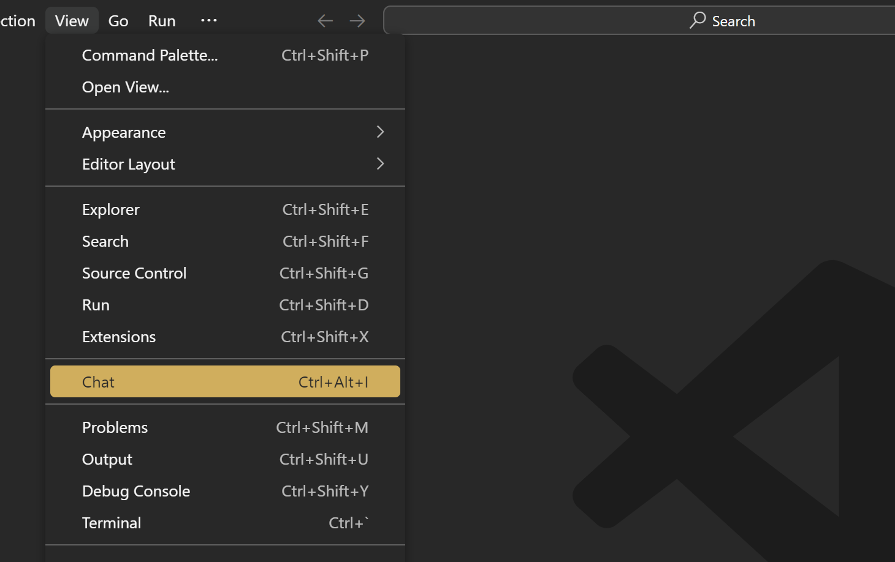
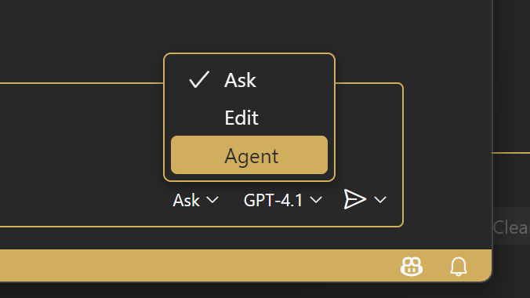
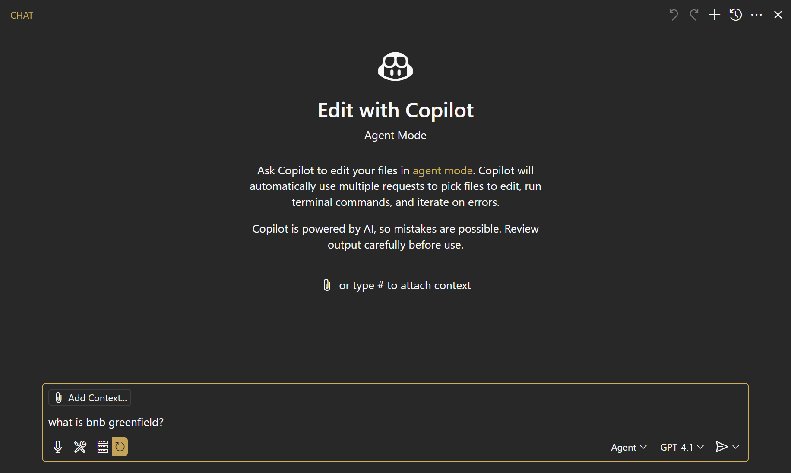
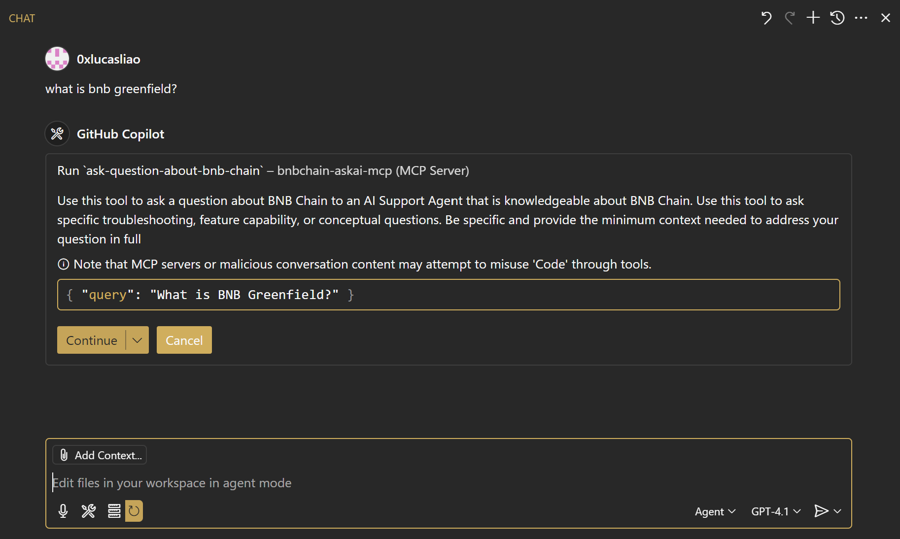
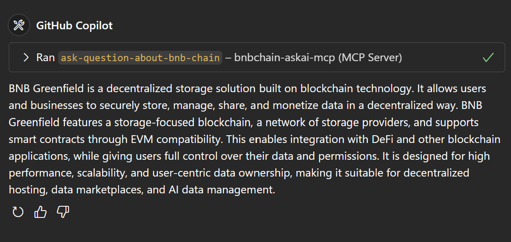

Step‑by‑step walkthrough to query BNB Chain documentation from within VS Code using the Model Context Protocol (MCP).

[← Ask AI quickstart](index.md) · [MCP overview](../mcp/index.md)

## 1 Install the MCP Client extension

1. Open the **Extensions** view.
2. Search for **“MCP Client”** and hit **Install**.



The extension adds MCP support to VS Code, letting you connect to external knowledge bases such as **BNB Chain Ask AI**.

---

## 2 Add the Ask AI server

1. Open **Settings** → **Preferences** → **Settings (JSON)**.
   *Tip ▶* press <kbd>Ctrl/⌘ +,</kbd> then click the **`{}`** icon in the upper‑right corner.
2. Inside the JSON, locate (or create) the **`"mcpServers"`** section and paste the snippet below as a sibling property.

```jsonc
{
  "mcpServers": {
    "bnbchain-askai-mcp": {
      "url": "https://api.superintern.ai/agent/async/mcp/mcp"
    }
  }
}
```



3. Save the file. The MCP client should automatically reload; if not, restart the VS Code window.

---

## 3 Start the MCP server

Hover the new server block and click **▶ Start**.



When the badge flips to **✓ Running**, VS Code is now connected to **BNB Chain Ask AI**.



---

## 4 Open the Chat panel

From the menu bar choose **View → Chat** or press <kbd>Ctrl + Alt + I</kbd>. A chat window docks to the side of the editor.



---

## 5 Pick the **bnbchain‑askai‑mcp** agent

At the bottom of the chat input you’ll find two dropdowns:

* **Mode** (Ask / Edit / Agent)
* **Provider** (list of LLMs & MCP servers)

Set **Mode** to **Agent**, then pick **bnbchain‑askai‑mcp** from the Provider list.



---

## 6 Ask your first question

1. Type a natural‑language query such as:

   ```text
   What is BNB Greenfield?
   ```

   

2. Press <kbd>Enter</kbd>. VS Code presents a confirmation card recommending the **bnbchain‑askai‑mcp** tool.

   

3. Click **Continue** (or just press <kbd>Enter</kbd> again). Ask AI streams back a concise answer plus source links you can click to jump to the original docs.

   

---

## 7 Bonus: Command Palette quick‑queries

Prefer keyboard? Hit <kbd>Ctrl/⌘ + Shift + P</kbd>, run **“MCP: Run Query”**, choose **bnbchain‑askai‑mcp**, and enter your question.

This opens a transient results panel without leaving your current editor tab.

---

### Need help?

* File an issue in the [docs repo](https://github.com/bnb-chain/bnb-chain.github.io/issues).

Happy building! 🎉
