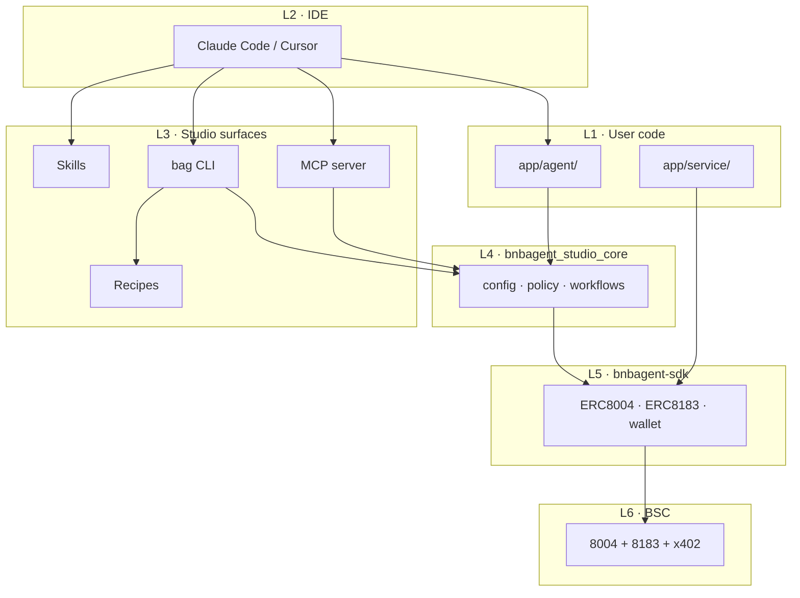

# Architecture

BNB Agent Studio wraps the [BNB Agent SDK](../bnbagent-sdk/index.md) with scaffolding, safety controls, and IDE integration. A v1 seller project is **two deployable artifacts** on top of a **six-layer stack**.

## Six-layer stack

| Layer | What |
|-------|------|
| **L1 — user code** | `app/agent/*`, `app/service/*` — emitted by recipes, you own and edit |
| **L2 — IDE** | Claude Code / Cursor — reads skills, calls CLI/MCP, edits your files |
| **L3 — surfaces** | `bag` CLI, MCP server, recipes, skills |
| **L4 — `bnbagent_studio_core`** | Wallet factory, `Policy`, ERC-8004/8183 workflows, x402, audit log |
| **L5 — `bnbagent-sdk`** | Protocol clients (`ERC8004Agent`, `ERC8183Client`, `EVMWalletProvider`) |
| **L6 — chain** | BSC testnet/mainnet — ERC-8004 registry, [APEX / ERC-8183](https://github.com/bnb-chain/apex-contracts#deployments), x402 |



## Two-layer deploy model

The split exists because AgentCore is invoke-only — no public HTTP routes, no background poll loop.

| Layer | Path | Deploy target | Holds key? | Runs LLM? |
|-------|------|---------------|------------|-----------|
| **A — Agent** | `app/agent/` | AWS Bedrock AgentCore | Yes (sole signer) | Yes |
| **B — Service** | `app/service/` | EC2 / Fargate | No (keyless) | No |

**Dependency is one-way:** Service → Agent. The public Service can only *ask* the Agent to sign; the Agent re-validates on chain before signing.

### Action envelopes

The Agent is invoked on fixed action envelopes — never via LLM tools:

| Action | Purpose |
|--------|---------|
| `quote` | Sign a price offer for a negotiate request |
| `fulfill` | Execute work and submit deliverable |
| `settle` | Apply policy verdict after dispute window |

All signing lives in `app/agent/signing.py` — fixed entrypoint code, never an LLM-callable tool.

## Recipe composition

`bag init` composes your project from orthogonal recipe axes:

```
bag/recipes/
├── frameworks/<X>/           e.g. frameworks/adk/
├── runtimes/<Y>/             e.g. runtimes/agentcore/
└── providers/<Z>/code/<framework>/
                              e.g. providers/pieverse-llm/code/adk/
```

| Axis | v1 default | Emitted into |
|------|------------|--------------|
| Framework | Google ADK | `app/agent/main.py`, `tools.py`, `managed_model.py` |
| Runtime | AgentCore | `app/agent/main.py`, `agentcore/agentcore.json` |
| LLM provider | Pieverse | `app/agent/managed_model.py` |
| Service | `8183-service` | `app/service/service.py` (framework-neutral, keyless) |

### Emitted vs library

**Emitted (user-owned — edit freely):**

- `app/agent/main.py` — runtime entrypoint
- `app/agent/managed_model.py` — provider × framework glue
- `app/agent/tools.py` — read-only chain tools for the LLM
- `app/agent/signing.py` — protocol-neutral signing entrypoints
- `app/service/service.py` — keyless Layer B

**Library (`bnbagent_studio_core` — shipped with `bnbagent-studio`):**

- `studio.toml` schema, audit log protocol
- `SigningPolicy`, `BudgetGate`, `expected_recipient`
- Wallet loader, ERC-8183 workflows, x402 buyer, `chain_readonly` tools
- Pieverse credit ensurer, SIWE retry

## Workspace isolation

`bag init` emits two **independent sub-projects**, each with its own `pyproject.toml`, `studio.toml`, and `.env.local`:

1. **Keystore outside deploy codeLocation** — `.studio/wallets/` at workspace root, outside `app/agent/`, so no packaging path bundles it.
2. **Keyless Service boundary** — Service sub-project has no `bnbagent-studio` dependency and no `[wallet]` config.
3. **Lean Service image** — ~200 MB smaller without studio CLI deps.
4. **No shared mutable config** — only `[network].default` and provider address sync across layers.

## Commerce flow (seller)

```
Buyer                    Layer B (Service)              Layer A (Agent)           BNB Chain
  │  POST /apex/negotiate        │                            │                        │
  │ ────────────────────────────►│ InvokeAgentRuntime(quote)  │                        │
  │                              │ ──────────────────────────►│ sign offer             │
  │ ◄────────────────────────────│ ◄──────────────────────────│                        │
  │  (funded job on-chain)       │                            │                        │
  │                              │ poll funded jobs           │                        │
  │                              │ InvokeAgentRuntime(fulfill)  │                        │
  │                              │ ──────────────────────────►│ execute + submit       │
  │                              │                            │ ──────────────────────►│
  │                              │ InvokeAgentRuntime(settle)   │                        │
  │                              │ ──────────────────────────►│ settle                 │
  │                              │                            │ ──────────────────────►│
```

## Core design principles

1. **Studio is not intelligent** — Claude Code / Cursor is the intelligence layer; studio provides recipes, CLI, MCP, and skills.
2. **Zero wallet abstraction** — studio uses `bnbagent-sdk`'s `WalletProvider` ABC via `get_wallet()`; no custom wrappers.
3. **Parallel payment protocols** — ERC-8183 and x402 each get independent CLI groups, recipes, and config sections.
4. **Payments are runtime services** — `@tool` functions in emitted code are the main battleground; CLI payment commands are operator diagnostics.

## Further reading

- [BNB Agent SDK architecture](../bnbagent-sdk/architecture.md) — protocol module system
- [GitHub — architecture.md](https://github.com/bnb-chain/bnbagent-studio/blob/main/docs/design/architecture.md) — full design document
- [GitHub — decisions.md](https://github.com/bnb-chain/bnbagent-studio/blob/main/docs/design/decisions.md) — decision records

[← BNB Agent Studio overview](index.md)
