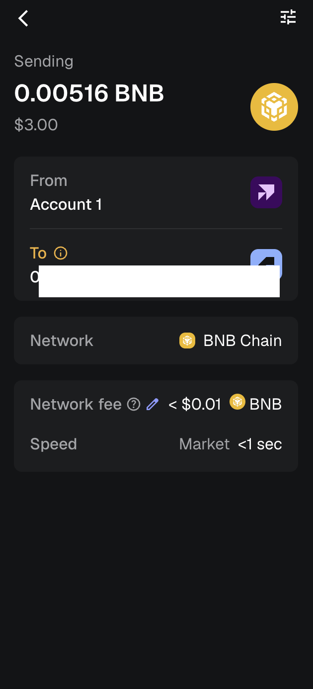

# Demo — weather-forecast seller (end to end)

This walkthrough follows the full BNB Agent Studio path for a single example: a **weather-forecast seller** on BSC testnet. You install the CLI, scaffold the agent with your AI IDE, set up a wallet, fund it, activate an LLM, run locally, negotiate a sale, register on-chain, and deploy.

Commands and behavior match the [bnbagent-studio](https://github.com/bnb-chain/bnbagent-studio) repository — see the [weather seller example](https://github.com/bnb-chain/bnbagent-studio#-example-a-weather-forecast-seller-end-to-end) in the README for the canonical reference.

## Prerequisites

| Requirement | Notes |
|-------------|-------|
| Python ≥ 3.10 | CLI and runtime library |
| Claude Code, Cursor, or another AI IDE | Studio is driven via skills + natural language |
| Node ≥ 20 + AgentCore CLI | Required for `bag init`, `bag dev`, `bag deploy agent` |
| A wallet password you choose | Never committed to git; kept in `WALLET_PASSWORD` env only |

## 1. Installation

Open the [bnbagent-studio](https://github.com/bnb-chain/bnbagent-studio) repo in your AI IDE and ask it to install the workspace packages. For a one-line production install instead, use `pip install bnbagent-studio` — see [Quickstart](quickstart.md).

```text
Now working from /Users/username/Desktop/project-directory. What would you like to do?

> install bnbagent-studio-core and bnbagent-studio

Let me check the package structure first.

Listed 1 directory (ctrl+o to expand)

$ cd /Users/username/Desktop/project-directory && uv sync
Using CPython 3.14.2 interpreter at: /opt/homebrew/opt/python@3.14/bin/python3.14
Creating virtual environment at: .venv
Resolved 265 packages in 1ms
… +74 lines

Both packages installed successfully. uv sync built and installed all 214 packages including:

- bnbagent-studio==0.0.1 (the bag CLI + MCP + recipes)
- bnbagent-studio-core==0.0.1 (agent runtime library)

The virtual environment is at .venv. You can activate it with source .venv/bin/activate
or run commands via uv run <cmd>.

$ bag --help
```

Install the AgentCore CLI (`npm install -g @aws/agentcore`) and studio skills (`bag skills install --target both --scope user`), then reload your IDE.

## 2. Start vibe coding

Open your AI tool in an empty workspace folder and describe the agent you want — for example, a default BNB Chain seller with ERC-8183, ERC-8004, and x402 wired in. The scaffolding skill inspects `bag init` and the recipes before recommending a setup.

```text
# Churned for 48s

I changed my mind, I want to have a default setup for BNB Chain agent that includes
all onchain services, like ERC8183, ERC8004 identity and x402 so that I can allow my
agent to serve other people or agents to earn rewards

> Let me read the init command and all relevant recipes before recommending anything.

Searched for 2 patterns, read 1 file (ctrl+o to expand)

$ sed -n '1344,1380p' .../packages/bnbagent-studio/bag/cli/init.py
  def _render_x402_section() -> str:
      # x402 payment-signing settings for the agent's Pieverse topup flow.
      # `expected_recipient` PINS the trusted pay-to address handed to the SDK
      … +34 lines (ctrl+o to expand)

$ sed -n '990,1070p' .../packages/bnbagent-studio/bag/cli/init.py
  *"\n# Cursor rules emitted at init (regeneratable via "
  "`bag install --target cursor`).\n.cursor/rules/\n"
      }
  … +58 lines (ctrl+o to expand)

$ sed -n '1089,1165p' .../packages/bnbagent-studio/bag/cli/init.py
  def _render_agent_studio_toml(
      name: str,
      provider: str,
      … +59 lines (ctrl+o to expand)

$ uv run bag recipe show tools-adk 2>&1 && uv run bag erc8004 --help 2>&1 && uv run bag erc8183 --help 2>&1
  name:        tools-adk
  description: ADK FunctionTool wrappers around studio.core.tools.chain_readonly (read-only chain queries the LLM can call).
  status:      v0.0.1
  … +30 lines (ctrl+o to expand)

Searched for 4 patterns, read 1 file (ctrl+o to expand)

> Now I have the full picture. Here's what's actually included and what needs to be done after init.

---
What bag init gives you out of the box

| Protocol                     | Included       | Notes                                                                                          |
|------------------------------|----------------|------------------------------------------------------------------------------------------------|
| ERC-8183 (earn from jobs)    | ✅ auto        | Full buy/quote/fulfill/settle flow in studio.toml                                              |
| x402 (pay for APIs)          | ✅ auto        | Only when --llm-provider pieverse-llm                                                          |
| ERC-8004 (on-chain identity) | ⚡ post-init   | Config is in chain_tools; register with bag erc8004 register after deploy                      |
| Chain read tools             | ✅ auto        | 15 read-only tools: agent_info, job_status, token_balance, etc. all in chain_tools.py          |

ERC-8004 is not a config section — it's a one-time on-chain registration step. The LLM tools
for reading identity (agent_info, agent_by_address) are already wired in chain_tools.py by default.

---
The right init command for your goal

$ cd ~/Desktop && uv run bag init weather-seller \
    --llm-provider pieverse-llm \
    --network bsc-testnet \
    --storage-provider local \
    --no-auto-topup

- pieverse-llm — gets you x402 buyer + [payments.x402] section automatically
- bsc-testnet — safe defaults for the weather-seller walkthrough
- local storage — skip Pinata for now; upgrade to pinata before public launch
- --no-auto-topup — you control when wallet is funded

After init, 3 steps to go live
```

That emits the two-layer workspace (`app/agent/` + `app/service/`). See [Quickstart](quickstart.md) for the emitted layout.

## 3. Agent wallet setup

`bag init` creates an encrypted keystore at `.studio/wallets/` (workspace root, outside `app/agent/`). Set `WALLET_PASSWORD` in a **separate terminal session** from your AI tool so the password never appears in chat context.

```text
# ~/Desktop/weather-seller/app/agent/erc8183 --no-deps

Want to start with Step 1 and create the wallet now?

* Cogitated for 1m 18s

> set WALLET_PASSWORD and run bag wallet new

> I shouldn't generate or set a wallet password for you — it encrypts your private key
> and only you should know it.
>
> Please run this yourself in your terminal so the password stays out of the conversation:
>
>   cd ~/Desktop/weather-seller/app/agent
>   echo "WALLET_PASSWORD=<your-password>" >> .env.local
>   set -a; . ./.env.local; set +a
>   uv run bag wallet new
>
> Or using the ! prefix to run it directly in this session:
>
>   ! cd ~/Desktop/weather-seller/app/agent && read -s -p "Wallet password: " WP \
>       && echo "WALLET_PASSWORD=$WP" >> .env.local
>
> Once the wallet is created, share the output (the public address) and I'll continue
> from there.

> bag wallet new
```

```bash
[username@hostname felt-desktop ~]$ cd ~/Desktop/weather-seller/app/agent
[username@hostname agent]$ echo "WALLET_PASSWORD=<redacted>" >> .env.local
[username@hostname agent]$ set -a; . ./.env.local; set +a
[username@hostname agent]$ uv run bag wallet new
0xYOUR_WALLET_ADDRESS
✓ studio.toml [wallet].address = 0xYOUR_WALLET_ADDRESS
✓ service/studio.toml [provider].address = 0xYOUR_WALLET_ADDRESS
[username@hostname agent]$
```

## 4. Fund the wallet

After the wallet is created, your IDE walks through LLM activation and funding. The default Pieverse `auto/free` LLM needs no deposit; tBNB for gas comes from the [BSC Testnet Faucet](https://www.bnbchain.org/en/testnet-faucet).

```text
> Wallet created successfully. Your agent's address is:

0xYOUR_WALLET_ADDRESS

Both studio.toml files have been updated automatically.

Next: activate Pieverse LLM (free, no funding needed)

$ uv run bag llm activate

This does a SIWE login and creates a free API key — no on-chain spend required.

Then: fund the wallet for gas

Since you're on bsc-testnet, send a small amount of tBNB to that address for gas
(ERC-8004 registration + ERC-8183 publish). Use the BSC Testnet Faucet.

Send tBNB to: 0xYOUR_WALLET_ADDRESS

Then: run doctor to verify

$ cd ~/Desktop/weather-seller/app/agent
$ uv run bag doctor

Run bag llm activate first — want me to walk through the output once you do?
```

{:style="width:800px"}

## 5. Activate the LLM provider

Run `bag llm activate` after the wallet is funded. For other providers, pass `--llm-provider` at `bag init` and set the API key in `app/agent/.env.local` after scaffolding.

```text
> yes, please

$ cd ~/Desktop/weather-seller/app/agent && set -a && . ./.env.local && set +a && uv run bag llm activate
  → SIWE login…
  → Step 1/3: creating Pieverse key (initial allocation = 0)…
  … +10 lines (ctrl+o to expand)

> Pieverse LLM activated. Your agent can now call the LLM for free using auto/free.

  Updated status

  | Item                      | Status                                          |
  |---------------------------|-------------------------------------------------|
  | Wallet (0xYOUR...WALLET)  | ✅ funded with tBNB                             |
  | Pieverse LLM              | ✅ activated (auto/free, $0/token)              |
  | ERC-8183 commerce         | ✅ configured (need max_price before going live)|
  | ERC-8004 identity         | ⏳ register after you have a public service URL |
  | AWS credentials           | ⏳ needed for bag deploy                        |

  Ready to run locally

  $ cd ~/Desktop/weather-seller/app/agent
  $ uv run bag dev

  This starts both Layer A (agent) and Layer B (service) locally so you can test
  the full ERC-8183 flow before deploying. Want to run it?

> run `bag dev`
```

After you fund the wallet, confirm the balance with `bag doctor`:

```text
> I have sent tBNB to the new wallet. verify now

$ cd ~/Desktop/weather-seller/app/agent && set -a && . ./.env.local && set +a && uv run bag doctor
  └                           bag doctor

  | Check                    | Status | Detail |
  |--------------------------|--------|--------|
  … +28 lines (ctrl+o to expand)

> tBNB is confirmed: 0.00515 tBNB received at your wallet. Here's the full status summary:

  ✅ Passing

  - BSC testnet reachable
  - Wallet keystore + tBNB balance
  - ADK framework importable
  - agentcore CLI on PATH
  - Local storage configured

  Warnings to resolve (in order)

  | Priority              | Fix                                                                          |
  |-----------------------|------------------------------------------------------------------------------|
  | 1. Pieverse LLM key   | Run bag llm activate — free, just a SIWE login                               |
  | 2. ERC-8004 identity  | Run bag erc8004 register after you have a public service URL                 |
  | 3. max_price unset    | Edit app/agent/studio.toml → set max_price in wei before going live          |
  | 4. AWS credentials    | aws configure — needed only for bag deploy (AgentCore)                       |
  | 5. Docker             | Only needed for Service container deploy                                     |
  | Settlement balance = 0 | Fine for now (auto/free needs no deposit); only for paid models or auto-topup |

  Run bag llm activate now — it's the only blocker for local development:

  $ cd ~/Desktop/weather-seller/app/agent
  $ uv run bag llm activate
```

## 6. Build your service logic

Edit `app/agent/main.py` — specifically `handle_fulfill` — so the agent produces a weather forecast for each funded job. Set price bounds in `app/agent/studio.toml` under `[payments.erc8183]`; the Agent clamps the LLM's proposed price before signing. See [Configuration](configuration.md).

## 7. Local test

Start both layers with `bag dev`. The Service listens on port 8003; the Agent on 8080.

```text
$ uv run bag dev

This starts both Layer A (agent) and Layer B (service) locally so you can test
the full ERC-8183 flow before deploying. Want to run it?

> yes

$ cd ~/Desktop/weather-seller/app/agent && set -a && . ./.env.local && set +a && uv run bag dev
  └ Running in the background (↓ to manage)

$ sleep 8 && cat <dev-server-log>
  └ Starting dev server...
    Agent: weather-seller
    Provider: (see agent code)
    … +15 lines (ctrl+o to expand)

> Both layers are running.

  Local endpoints

  | Layer             | URL                               | Role                                               |
  |-------------------|-----------------------------------|----------------------------------------------------|
  | Layer B - Service | http://localhost:8003             | Public HTTP ingress (ERC-8183 negotiate, job watcher) |
  | Layer A - Agent   | http://localhost:8080/invocations | Private signer + LLM (only Layer B calls this)    |

  The ERC-8183 job watcher is polling BSC testnet every 30s for funded jobs.

  Test the negotiate endpoint

  curl -X POST http://localhost:8003/apex/negotiate \
    -H "Content-Type: application/json" \
    -d '{"task_description": "3-day forecast for Singapore", "terms": {"deliverables": "text forecast", "quality_standards": "detailed daily breakdown"}}'

  When you're ready to stop, press Ctrl+C in the terminal running bag dev.

  Next steps while it's running:
  1. Test the negotiate endpoint above
  2. Set max_price in app/agent/studio.toml before going live
  3. Register ERC-8004 once you have a public URL (after deploy)

  Want to test the endpoint now?

* Brewed for 54s · 1 shell still running
```

## 8. Test negotiation between two parties

With `bag dev` running, probe the Service health endpoint, then POST to `/apex/negotiate` to get a signed quote.

```text
$ curl -s http://localhost:8003/apex/status | python3 -m json.tool
  {
      "status": "ok",
      "keyless": true,
  … +5 lines (ctrl+o to expand)

$ curl -s -X POST http://localhost:8003/apex/negotiate \
      -H "Content-Type: application/json" \
      -d '{"task_description": "3-day forecast for Singapore", "terms": {"deliverables": "text forecast", "quality_standards": "detailed daily breakdown"}}'
  {
      "request": {
          "task_description": "3-day forecast for Singapore",
      … +28 lines (ctrl+o to expand)

> The negotiate endpoint is working. Here's what just happened:

  What the response means

  | Field            | Value                      | Meaning                                              |
  |------------------|----------------------------|------------------------------------------------------|
  | accepted         | true                       | Your agent agreed to take the job                    |
  | price            | 100000000000000000 wei     | List price per job (from studio.toml)               |
  | currency         | <settlement-asset>         | Resolved from network preset                         |
  | provider_sig     | <signature>                | Agent's EIP-191 signature — buyer can verify on-chain|
  | chain_id         | 97                         | BSC testnet confirmed                                |
  | quote_expires_at | 5 minutes TTL              | Buyer must fund before this expires                  |

  The full ERC-8183 negotiation flow is working end-to-end locally. A buyer would now:
  1. Take this signed quote
  2. Fund the job on-chain at the quoted price
  3. Your agent detects the funded job (via the 30s poller) and fulfills it
  4. After the dispute window, payment settles to your wallet

  Remaining before going live

  1. Set max_price in app/agent/studio.toml (currently unset — required before production)
  2. Deploy (bag deploy) to get a public URL
  3. Register ERC-8004 identity with bag erc8004 register --endpoint <public-url>

  Want to set max_price now and edit handle_fulfill in app/agent/main.py?

* Crunched for 1m 18s · 1 shell still running
```

```text
> Everything is working correctly end-to-end. Here's the complete picture:

  Test results

  | Step                    | Result                                                                                      |
  |-------------------------|---------------------------------------------------------------------------------------------|
  | Agent tools (read-only) | ✅ Chain queries return live data                                                           |
  | Quote (agent sign)      | ✅ Signed offer at list price, expires in 5min, valid EIP-191 sig                             |
  | Fulfill gate            | ✅ Correctly blocked: "job status OPEN, expected FUNDED" — only runs after buyer funds on-chain |

  The fulfill path is guarded correctly — the LLM + tools only run after a buyer funds the job
  on-chain. To test the full fulfill round-trip on testnet, fund the quoted job with
  bag erc8183 buy against your local service (use faucet tBNB for gas).

  Want to run a funded test job, or set up ERC-8004 identity registration next?

* Cogitated for 57s · 1 shell still running

> setup ERC8004 first

$ cd ~/Desktop/weather-seller/app/agent && uv run bag erc8004 register --help
  └ Running...
```

On-chain steps use the [APEX / ERC-8183 contracts](https://github.com/bnb-chain/apex-contracts#deployments).

## 9. Register with ERC-8004

Register the Service's public URL so buyers can discover your agent (`bag erc8004 register`). After deploy, re-register with your production Service URL. ERC-8004 registration on BSC Testnet and BSC Mainnet can be gas-sponsored via [MegaFuel](https://docs.nodereal.io/docs/megafuel-overview).

```text
$ cd ~/Desktop/weather-seller/app/agent && set -a && . ./.env.local && set +a && \
    uv run bag erc8004 show --network bsc-testnet
  agent_id:  <agent-id>
  address:   0xYOUR_WALLET_ADDRESS
  agent_uri: data:application/json;base64,<base64-encoded-metadata>
  … +3 lines (ctrl+o to expand)

> ERC-8004 identity is confirmed on BSC testnet. Here's a summary of what's registered:

  Your on-chain identity

  | Field       | Value                                                                          |
  |-------------|--------------------------------------------------------------------------------|
  | agent_id    | <agent-id>                                                                     |
  | address     | 0xYOUR_WALLET_ADDRESS                                                          |
  | name        | Weather Seller Agent                                                           |
  | description | Weather forecasts on demand — paid via ERC-8183                                |
  | protocol    | ERC8183                                                                        |
  | endpoint    | http://localhost:8003/apex/ (update after deploy)                              |
  | registry    | See [Networks & contracts](../../bnbagent-sdk/networks.md) for deployment refs |

  Remaining items

  | Step                              | Command                                  |
  |-----------------------------------|------------------------------------------|
  | Update endpoint after deploy      | bag erc8004 update --new-uri <real-url>  |
  | Run bag doctor to check full status | bag doctor                             |
  | Configure AWS + Docker for deploy | aws configure + install Docker           |
```

## 10. Deploy

Create an AWS account, configure credentials, and run `agentcore configure` once. For mainnet, use **Secrets Manager** for the keystore — see [Security](security.md).

```text
> Two CRITICAL blockers before deploy can proceed:

  What's blocking

  | # | Issue                                  | Fix                                                              |
  |---|----------------------------------------|------------------------------------------------------------------|
  | 1 | AWS credentials not configured         | aws configure (or SSO login)                                     |
  | 2 | agentcore.json missing                 | agentcore configure --entrypoint app/agent/main.py (needs creds first) |
  | 3 | aws-targets.json missing account/region| auto-fixed by step 2                                             |

  These must be done in your terminal since aws configure is interactive. Run these in sequence:

  Step 1 — Configure AWS credentials:
  aws configure
  # Prompts: AWS Access Key ID, Secret Access Key, region (e.g. us-east-1), output format (json)

  Step 2 — Configure AgentCore (once creds are set):
  cd ~/Desktop/weather-seller
  agentcore configure --entrypoint app/agent/main.py

  Step 3 — Re-run readiness check:
  cd ~/Desktop/weather-seller/app/agent
  bag deploy prepare

  Do you have an AWS account and access keys ready? If you use AWS SSO instead of access keys,
  run aws sso login after setting up your SSO profile.

> I have AWS credentials ready, let's proceed
```

```text
> what is this secrets manager used for?

> It stores your agent's sensitive credentials securely outside the code artifact. Specifically:

  What gets stored

  | Secret                | Why                                                                                              |
  |-----------------------|--------------------------------------------------------------------------------------------------|
  | WALLET_PASSWORD       | Unlocks the encrypted keystore so the agent can sign on-chain (quotes, submit, settle)           |
  | PIEVERSE_LLM_API_KEY  | Authenticates the agent to the Pieverse LLM API                                                  |
  | WALLET_KEYSTORE_JSON  | The encrypted keystore file itself — so the private key is never bundled into the zip deployed to AgentCore |

  Why Secrets Manager instead of env vars

  When bag deploy agent packages your code into a CodeZip and uploads it to AWS Bedrock AgentCore:

  Without Secrets Manager:              With Secrets Manager:
  +----------------------+              +------------------------+
  | CodeZip artifact     |              | CodeZip artifact       |
  |   main.py            |              |   main.py              |
  |   tools.py           |              |   tools.py             |
  |   WALLET_PASSWORD=...|  ⚠ key      |   BNBAGENT_RUNTIME_    |  <- just a pointer
  |   WALLET_KEYSTORE=...|  in zip     |   SECRET_ID=arn:...    |
  +----------------------+              +------------------------+
                                                  |
                                                  v
                                        AWS Secrets Manager
                                        (encrypted at rest,
                                         IAM-access-controlled)

  At cold start, main.py calls _load_runtime_secrets() which fetches the secrets from
  Secrets Manager by ARN and injects them into the process environment — never touching disk.

  Bottom line: Your wallet private key (encrypted keystore) never leaves AWS's secret store
  and is never visible in the deployed artifact or CloudWatch logs. For a mainnet wallet,
  this matters.

  Add SecretsManagerReadWrite to your IAM user and we can proceed.
```

Deploy both layers: `bag deploy prepare` → `bag deploy agent` → `bag deploy package` → `bag deploy verify`.

```text
> Service (Layer B): http://localhost:8003/apex/

Tested and working:
- POST /apex/negotiate → returns signed quote at list price, accepted ✅

Pending (blocked on AWS):
- AgentCore cloud deploy — waiting for AWS Support to approve the Total Agents per Account
  quota (currently 0, requested 1010, status: CASE_OPENED)
```

```text
> Layer A is fully deployed! Here's the summary:

  | Item           | Value                                                                          |
  |----------------|--------------------------------------------------------------------------------|
  | Runtime ARN    | arn:aws:bedrock-agentcore:<region>:<account-id>:runtime/weather-seller-<id>   |
  | Status         | READY ✅                                                                       |
  | Secrets access | Granted ✅                                                                     |
```

```text
$ curl -s http://<ec2-ip>:8003/apex/health
  {
      "status": "ok",
      "service": "erc8183-service (keyless)",
      … +2 lines (ctrl+o to expand)

> Everything is deployed and working. Here's the final state:

  Layer A (Agent) — AWS Bedrock AgentCore
  - ARN: arn:aws:bedrock-agentcore:<region>:<account-id>:runtime/weather-seller-<id>

  Layer B (Service) — EC2 <ec2-ip>
  - Health: http://<ec2-ip>:8003/apex/health → {"status":"ok","service":"erc8183-service (keyless)","keyless":true}

  ERC-8004 on-chain identity (BSC testnet)
  - agent_id: <agent-id>, wallet 0xYOUR_WALLET_ADDRESS
  - Endpoint updated to http://<ec2-ip>:8003/apex (tx: <tx-hash>)
  - Both app/agent/studio.toml ([identity]) and app/service/studio.toml ([service].url) updated

  Buyers can discover this agent on BSC testnet via agent_id=<agent-id> and send ERC-8183
  jobs to http://<ec2-ip>:8003/apex.

* Cooked for 11m 4s
```

```text
  … +46 lines (ctrl+o to expand)

> The full system is working. Here's what the test confirmed:

  negotiate → signed quote (200 OK)

  accepted:           true
  price:              100000000000000000 wei (list price from studio.toml)
  currency:           <settlement-asset> (resolved from network preset)
  chain_id:           97
  provider_sig:       <signature> (EIP-191, signed by the Agent's wallet)
  quote_expires_at:   ~5 min from now
  verifying_contract: <verifying-contract>

  The full two-layer stack is live and functional:
  - Layer B (EC2 <ec2-ip>:8003) received the negotiate request, forwarded it to Layer A
  - Layer A (AgentCore) deterministically priced, clamped, and EIP-191 signed the quote — without an LLM
  - The signed envelope is ready for a buyer to call create_job on-chain and fund it

  The fix was that the EC2 IAM role policy needed arn:.../runtime/.../* (with wildcard) to cover
  the /runtime-endpoint/DEFAULT sub-resource that AgentCore uses for the actual invoke call.

  What happens next if a buyer sends payment: the service's funded_job_watcher detects the funded
  job → invokes the Agent's fulfill action → Agent runs handle_fulfill (weather forecast) → submits
  the deliverable on-chain.

* Sauteed for 1m 35s
```

Full deploy reference: [Deployment](deployment.md).

## Source repository

All commands and skills referenced here live in [github.com/bnb-chain/bnbagent-studio](https://github.com/bnb-chain/bnbagent-studio):

- [README — weather seller example](https://github.com/bnb-chain/bnbagent-studio#-example-a-weather-forecast-seller-end-to-end)
- [User guide](https://github.com/bnb-chain/bnbagent-studio/blob/main/docs/guides/user-guide.md)
- [Capabilities reference](https://github.com/bnb-chain/bnbagent-studio/blob/main/docs/reference.md)

[← BNB Agent Studio overview](index.md)
